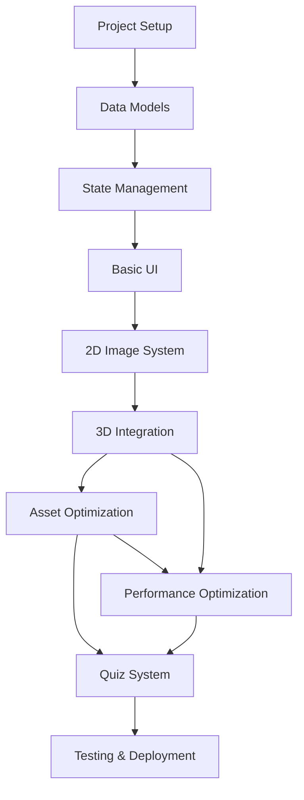

# Implementation Roadmap - Flutter Card Memorization App

## Project Overview

This roadmap outlines a structured, phased approach to implementing the Flutter card memorization application with 52 playing cards, 2D/3D view modes, interactive features, and quiz functionality.

## Development Phases

### Phase 1: Foundation & Core Infrastructure (Weeks 1-3)

#### Sprint 1.1: Project Setup & Basic Structure (Week 1)
**Deliverables:**
- [ ] Flutter project initialization with proper folder structure
- [ ] Development environment setup (VS Code/Android Studio, emulators)
- [ ] Git repository setup with proper .gitignore and branching strategy
- [ ] Basic pubspec.yaml configuration with core dependencies
- [ ] Fundamental app structure (main.dart, routing, themes)

**Key Dependencies:**
```yaml
dependencies:
  flutter:
    sdk: flutter
  flutter_riverpod: ^2.4.9
  flutter_3d_controller: ^1.3.0
  go_router: ^12.1.3
  shared_preferences: ^2.2.2
  
dev_dependencies:
  flutter_test:
    sdk: flutter
  flutter_lints: ^3.0.1
  build_runner: ^2.4.7
```

**Technical Tasks:**
```dart
// Project structure
lib/
├── main.dart
├── app.dart
├── core/
│   ├── constants/
│   ├── themes/
│   └── utils/
├── data/
│   ├── models/
│   ├── repositories/
│   └── services/
├── presentation/
│   ├── screens/
│   ├── widgets/
│   └── providers/
└── assets/
    ├── cards/
    │   ├── images/
    │   └── models/
    └── ui/
```

#### Sprint 1.2: Data Models & Card System (Week 2)
**Deliverables:**
- [ ] Card data model implementation
- [ ] Playing card enumeration (suits, ranks, card IDs)
- [ ] Card data service with all 52 cards
- [ ] Basic asset management setup
- [ ] Unit tests for data models

**Core Models:**
```dart
// Card model with image and 3D paths
class Card {
  final String id;         // 'c1', 'd2', 'h3', 'sk'
  final String name;       // 'Ace of Clubs'
  final Suit suit;
  final Rank rank;
  final String imagePath;
  final String modelPath;
}

// Support enums
enum Suit { clubs, diamonds, hearts, spades }
enum Rank { ace, two, three, ..., king }
```

#### Sprint 1.3: State Management Foundation (Week 3)
**Deliverables:**
- [ ] Riverpod provider setup
- [ ] Card navigation state management
- [ ] View mode toggle implementation
- [ ] Basic app state providers
- [ ] Provider testing setup

**Core Providers:**
```dart
// Essential providers
final cardDataProvider = Provider<List<Card>>();
final currentCardIndexProvider = StateNotifierProvider<CardIndexNotifier, int>();
final viewModeProvider = StateNotifierProvider<ViewModeNotifier, ViewMode>();
final appStateProvider = StateNotifierProvider<AppStateNotifier, AppState>();
```

### Phase 2: UI Foundation & Basic Features (Weeks 4-6)

#### Sprint 2.1: Basic UI Components (Week 4)
**Deliverables:**
- [ ] Main screen layout and navigation
- [ ] Basic card display widget (image only)
- [ ] Navigation controls (previous/next buttons)
- [ ] Card counter display (X/52)
- [ ] Basic theming and visual design

**UI Components:**
```dart
class MainScreen extends ConsumerWidget
class CardDisplayWidget extends ConsumerWidget
class NavigationControls extends ConsumerWidget
class CardCounter extends ConsumerWidget
```

#### Sprint 2.2: 2D Image Display System (Week 5)
**Deliverables:**
- [ ] Image asset loading and optimization
- [ ] Responsive image display
- [ ] Image caching implementation
- [ ] Error handling for missing assets
- [ ] Image zoom/pan gestures (optional)

**Features:**
- High-quality card image rendering
- Proper aspect ratio maintenance
- Loading states and error handling
- Smooth transitions between cards

#### Sprint 2.3: Core Navigation & Interactions (Week 6)
**Deliverables:**
- [ ] Tap-to-toggle view mode implementation
- [ ] Keyboard navigation support
- [ ] Swipe gestures for card navigation
- [ ] Random shuffle functionality
- [ ] Smooth animations between states

**Gesture Implementation:**
```dart
class CardGestureDetector extends StatelessWidget {
  // Tap: toggle 2D/3D view
  // Swipe: navigate cards
  // Long press: show context menu
}
```

### Phase 3: 3D Integration & Advanced Features (Weeks 7-10)

#### Sprint 3.1: 3D Rendering Setup (Week 7)
**Deliverables:**
- [ ] flutter_3d_controller integration
- [ ] Basic 3D model display functionality
- [ ] 3D viewer component implementation
- [ ] Camera controls and interaction
- [ ] 3D loading states and error handling

**3D Integration:**
```dart
class Card3DViewer extends ConsumerStatefulWidget {
  final String cardId;
  // 3D model loading and display
  // Camera orbit controls
  // Loading/error states
}
```

#### Sprint 3.2: Asset Optimization & Deferred Loading (Week 8)
**Deliverables:**
- [ ] Deferred component setup for 3D models
- [ ] Progressive asset loading implementation
- [ ] Asset cache management system
- [ ] Performance monitoring tools
- [ ] Loading progress indicators

**Deferred Loading:**
```dart
class DeferredAssetLoader {
  static Future<bool> loadCardModel(String cardId);
  static Future<void> preloadPopularCards();
  static bool isCardModelLoaded(String cardId);
}
```

#### Sprint 3.3: Enhanced 3D Interactions (Week 9)
**Deliverables:**
- [ ] Smooth 2D ↔ 3D view transitions
- [ ] 3D model rotation and camera controls
- [ ] Preset camera positions
- [ ] Touch gesture optimization for 3D
- [ ] Performance optimization for smooth 60fps

#### Sprint 3.4: Polish & Optimization (Week 10)
**Deliverables:**
- [ ] Performance profiling and optimization
- [ ] Memory usage optimization
- [ ] Battery usage optimization
- [ ] Accessibility improvements
- [ ] Bug fixes and stability improvements

### Phase 4: Quiz System & Game Logic (Weeks 11-14)

#### Sprint 4.1: Quiz Foundation (Week 11)
**Deliverables:**
- [ ] Quiz data models and state management
- [ ] Question generation system
- [ ] Multiple quiz modes (identification, memory, sequence)
- [ ] Quiz flow navigation
- [ ] Score tracking and persistence

**Quiz Models:**
```dart
class QuizState {
  final List<QuizQuestion> questions;
  final int currentQuestionIndex;
  final Map<int, QuizAnswer> answers;
  final QuizMode mode;
  final QuizStatus status;
}

enum QuizMode { identification, memory, sequence, matching }
```

#### Sprint 4.2: Quiz UI Implementation (Week 12)
**Deliverables:**
- [ ] Quiz interface components
- [ ] Question display and answer input
- [ ] Multiple choice UI implementation
- [ ] Timer and progress indicators
- [ ] Results screen with detailed feedback

#### Sprint 4.3: Advanced Quiz Features (Week 13)
**Deliverables:**
- [ ] Quiz customization options
- [ ] Difficulty level adjustments
- [ ] Historical performance tracking
- [ ] Achievement system
- [ ] Quiz statistics and analytics

#### Sprint 4.4: Game Polish & Features (Week 14)
**Deliverables:**
- [ ] Sound effects and haptic feedback
- [ ] Animations and visual polish
- [ ] Tutorial system
- [ ] Settings and preferences
- [ ] Data export/import functionality

### Phase 5: Testing & Deployment (Weeks 15-16)

#### Sprint 5.1: Comprehensive Testing (Week 15)
**Deliverables:**
- [ ] Unit test coverage >90%
- [ ] Widget testing for all major components
- [ ] Integration testing for user flows
- [ ] Performance testing and benchmarks
- [ ] Accessibility testing compliance

**Testing Strategy:**
```dart
// Unit tests
test/unit/models/
test/unit/services/
test/unit/providers/

// Widget tests
test/widget/screens/
test/widget/components/

// Integration tests
integration_test/
├── app_flow_test.dart
├── quiz_flow_test.dart
└── performance_test.dart
```

#### Sprint 5.2: Platform Optimization & Deployment (Week 16)
**Deliverables:**
- [ ] Android app bundle optimization
- [ ] iOS build configuration and testing
- [ ] Web deployment setup (if applicable)
- [ ] App store metadata and screenshots
- [ ] Release build testing and validation

## Technical Milestones & Dependencies

### Critical Path Dependencies



### Risk Mitigation Strategies

#### High-Risk Items:
1. **3D Model Performance**: Flutter WebView-based 3D rendering limitations
   - **Mitigation**: Early performance testing, fallback to 2D mode
   - **Timeline**: Week 7-8 validation

2. **Asset Size Management**: 50-70MB of 3D models
   - **Mitigation**: Deferred loading implementation priority
   - **Timeline**: Week 8 critical milestone

3. **Platform Compatibility**: flutter_3d_controller platform differences
   - **Mitigation**: Multi-platform testing from week 7
   - **Timeline**: Continuous validation

#### Medium-Risk Items:
1. **Memory Usage**: Large asset files causing OOM
   - **Mitigation**: Asset cache management and monitoring
2. **State Complexity**: Quiz state management complexity
   - **Mitigation**: Comprehensive provider testing

### Quality Gates

#### Phase Completion Criteria:

**Phase 1 Complete:**
- [ ] All 52 cards loadable with metadata
- [ ] Basic navigation functional
- [ ] State management tested
- [ ] >85% test coverage for core models

**Phase 2 Complete:**
- [ ] Smooth card navigation
- [ ] 2D images display correctly
- [ ] View toggle mechanism working
- [ ] UI responsive on target devices

**Phase 3 Complete:**
- [ ] 3D models render correctly
- [ ] Deferred loading functional
- [ ] Performance targets met (60fps)
- [ ] Memory usage within limits (<100MB)

**Phase 4 Complete:**
- [ ] Quiz modes fully functional
- [ ] Score persistence working
- [ ] All quiz types implemented
- [ ] Statistics tracking accurate

**Phase 5 Complete:**
- [ ] All tests passing
- [ ] Performance benchmarks met
- [ ] App store ready builds
- [ ] Documentation complete

## Development Resources & Team Structure

### Recommended Team Composition:
- **Flutter Developer (Lead)**: Architecture, state management, core features
- **UI/UX Developer**: Interface design, animations, user experience
- **3D/Graphics Specialist**: 3D model optimization, rendering performance
- **QA Engineer**: Testing strategy, automation, device compatibility

### Development Environment:
- **IDE**: VS Code or Android Studio
- **Flutter Version**: 3.16.x (stable)
- **Dart Version**: 3.2.x
- **Testing Devices**: 
  - Android: Pixel 6, Samsung Galaxy S21
  - iOS: iPhone 12, iPhone 14
  - Various screen sizes and Android API levels

### Performance Targets:
- **Initial Load Time**: <3 seconds
- **3D Model Load Time**: <5 seconds per model
- **Memory Usage**: <100MB peak usage
- **Frame Rate**: 60fps during animations
- **Battery Impact**: <5% per 30-minute session

## Post-Launch Roadmap

### Version 1.1 (Month 2-3):
- [ ] AR viewer integration
- [ ] Cloud progress sync
- [ ] Social sharing features
- [ ] Advanced analytics

### Version 1.2 (Month 4-6):
- [ ] Custom card decks
- [ ] Multiplayer quiz modes
- [ ] Machine learning difficulty adjustment
- [ ] Voice recognition features

### Version 2.0 (Month 7-12):
- [ ] Complete UI redesign
- [ ] VR compatibility
- [ ] Educational content integration
- [ ] Professional educator tools

This roadmap provides a structured approach to building a robust, scalable Flutter application that meets all technical requirements while maintaining high code quality and performance standards.